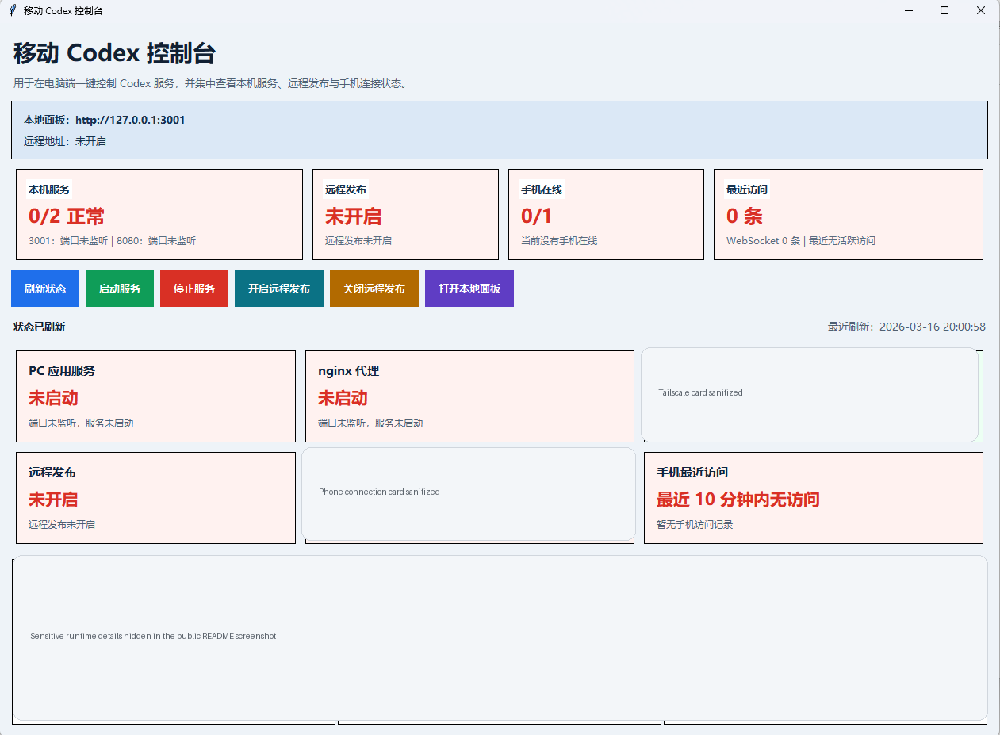

# mobileCodexHelper

[中文](README.md) | [English](README.en.md)

把你电脑上本地运行的 Codex 会话，变成一个可以在手机上访问和控制的私有网页面板。

这个项目适合下面这种需求：

- 你平时在电脑上跑 Codex
- 你想在手机上随时查看项目、会话、消息
- 你想从手机继续发消息，让电脑上的 Codex 接着执行
- 你希望默认是私有访问，并且新手机第一次登录要经过电脑批准

如果你不熟悉这类项目，也没关系。按下面步骤做，目标就是“从零部署起来并能在手机上用”。

## 界面预览

下面这张图是 Windows 桌面控制工具的公开 README 预览图：



## 它能做什么

- 在手机浏览器中查看 Codex 项目和会话
- 在手机上发送消息，继续控制电脑上的 Codex
- 首次登录新设备时，必须由电脑端批准
- 在 Windows 桌面工具中查看：
  - 本地服务状态
  - 远程发布状态
  - 已批准设备白名单
  - 待审批设备列表

## 它不能做什么

- 不适合多人协作
- 不建议把 Node 服务直接暴露到公网
- 默认不是远程桌面，也不是完整 IDE
- 重点是“手机查看和聊天控制”，不是开放所有高风险能力

## 整体工作方式

推荐架构如下：

```text
手机浏览器
   ↓
Tailscale 私网 HTTPS
   ↓
本机 nginx 代理
   ↓
本机 claudecodeui（已套用本项目补丁）
   ↓
电脑上的 Codex 会话
```

## 你需要准备什么

请先在 Windows 电脑上准备：

### 必装

- Python 3.11 或更高
- Node.js 22 LTS
- Git
- nginx for Windows
- 一个可正常使用的 Codex 本地环境

### 强烈推荐

- Tailscale

原因很简单：

- 这是最容易做成“只有你自己能访问”的远程方案
- 比直接公网暴露安全得多

## 最快部署路线

如果你不想一开始看太多说明，可以先照下面这条最短路径做：

### 电脑上

1. 安装 Python 3.11+、Node.js 22、nginx、Tailscale
2. 把上游 `claudecodeui v1.25.2` 放到 `vendor/claudecodeui-1.25.2`
3. 运行：

```powershell
powershell -ExecutionPolicy Bypass -File scripts/apply-upstream-overrides.ps1
cd vendor/claudecodeui-1.25.2
npm install
cd ..\..
powershell -ExecutionPolicy Bypass -File scripts/start-mobile-codex-stack.ps1
python mobile_codex_control.py
```

4. 在电脑浏览器打开：

```text
http://127.0.0.1:3001
```

5. 完成第一次注册

### 手机上

1. 手机安装并登录 Tailscale
2. 电脑执行：

```powershell
powershell -ExecutionPolicy Bypass -File scripts/enable-mobile-codex-remote.ps1
```

3. 手机打开 Tailscale 提供的私有 HTTPS 地址
4. 用刚才注册的账号登录
5. 如果手机提示等待批准，就到电脑桌面工具里批准这台设备

做到这里，你通常已经可以从手机继续控制电脑上的 Codex 了。

## 第一步：下载本项目

把当前仓库放到一个你自己的工作目录，例如：

```text
D:\mobileCodexHelper
```

后面文档里的路径都以这个目录为例。

## 第二步：下载上游 claudecodeui

本项目不是完整替代上游，而是“在上游基础上的安全收敛和手机控制增强层”。

请把上游 `siteboon/claudecodeui` 的 `v1.25.2` 源码下载到：

```text
vendor/claudecodeui-1.25.2
```

也就是最终目录像这样：

```text
mobileCodexHelper/
├─ vendor/
│  └─ claudecodeui-1.25.2/
├─ upstream-overrides/
├─ scripts/
├─ deploy/
└─ mobile_codex_control.py
```

## 第三步：把本项目补丁应用到上游源码

在项目根目录运行：

```powershell
powershell -ExecutionPolicy Bypass -File scripts/apply-upstream-overrides.ps1
```

这一步会把 `upstream-overrides/claudecodeui-1.25.2/` 里的修改覆盖到上游源码目录里。

## 第四步：安装上游依赖

进入上游目录：

```powershell
cd vendor/claudecodeui-1.25.2
npm install
```

如果你只想先运行，不打包桌面工具，那么 Python 侧通常不需要额外第三方依赖。

如果你想把桌面工具打包成 `.exe`，再执行：

```powershell
pip install -r requirements.txt
```

## 第五步：检查本机环境

回到项目根目录后，先运行：

```powershell
powershell -ExecutionPolicy Bypass -File scripts/check-mobile-codex-runtime.ps1
```

你需要重点确认输出中的几项：

- `UpstreamExists = True`
- `Node` 有值
- `Nginx` 有值
- 如果要走私网远程访问，`Tailscale` 也应有值

## 第六步：启动本地服务

直接执行：

```powershell
powershell -ExecutionPolicy Bypass -File scripts/start-mobile-codex-stack.ps1
```

这个脚本会做两件事：

1. 启动本地 `claudecodeui` 服务
2. 启动本地 nginx 代理

默认端口：

- 应用：`127.0.0.1:3001`
- 代理：`127.0.0.1:8080`

## 第七步：打开桌面控制工具

你可以直接运行：

```powershell
python mobile_codex_control.py
```

或者：

```powershell
scripts\launch-mobile-codex-control.cmd
```

桌面工具里你可以看到：

- PC 应用服务是否正常
- nginx 是否正常
- Tailscale 是否登录
- 远程发布是否正常
- 手机设备在线情况
- 待审批设备

## 第八步：第一次注册 / 登录

第一次使用时，先在电脑浏览器打开本地页面：

```text
http://127.0.0.1:3001
```

完成首次账号注册。

说明：

- 这是单用户系统
- 第一个注册的账号就是你的管理账号

## 第九步：手机访问

### 只在局域网/本机测试

你可以先在电脑本机浏览器测试登录流程是否正常。

### 通过 Tailscale 私网远程访问

如果你已经在电脑和手机上登录同一个 Tailscale 网络，执行：

```powershell
powershell -ExecutionPolicy Bypass -File scripts/enable-mobile-codex-remote.ps1
```

然后在桌面工具里查看远程发布状态。

手机端推荐使用：

- 手机浏览器直接访问
- 或者你自己的 WebView/网页封装 App

## 第十步：设备首次登录审批

这是本项目最重要的安全机制之一。

当一个新手机或新 WebView 第一次登录时：

1. 手机端会提示“等待电脑端批准”
2. 电脑端桌面控制工具会出现待审批设备
3. 你核对设备名、平台、UA、IP 后点击“批准所选”
4. 手机端自动继续登录

这样做的好处是：

- 即使账号密码泄露，未知设备也不能直接登录
- 你可以控制哪些手机被加入白名单

## 部署成功的判断标准

如果下面这些都满足，说明部署基本成功：

- 电脑端 `http://127.0.0.1:3001` 能打开
- 桌面控制工具里 PC 应用服务和 nginx 都是正常
- 手机能打开私有 HTTPS 地址
- 手机首次登录时，电脑端能看到待审批设备
- 你批准后，手机能进入项目和会话列表
- 手机发送消息后，电脑上的 Codex 会继续执行

## 最容易失败的 3 个点

如果你第一次部署就遇到问题，通常优先排查这 3 个地方：

### 1. 上游目录版本或路径不对

必须是：

- 上游版本：`v1.25.2`
- 目录名：`vendor/claudecodeui-1.25.2`

如果你不确定覆盖流程是否真的成功，可以先跑一遍：

```powershell
powershell -ExecutionPolicy Bypass -File scripts/smoke-test-override-flow.ps1 -UpstreamZip <你的上游zip路径>
```

### 2. 本机依赖路径没有被脚本找到

最常见的是：

- `node.exe`
- `nginx.exe`
- `tailscale.exe`

先运行：

```powershell
powershell -ExecutionPolicy Bypass -File scripts/check-mobile-codex-runtime.ps1
```

只要里面有空值，就先不要继续下一步。

### 3. 手机封装壳不兼容

如果手机浏览器能登录，但封装成 App 的 WebView 不行，先默认怀疑是壳兼容问题，不要先怀疑账号密码。

优先建议：

- 先用手机浏览器打通全流程
- 再测试封装 App
- 确认壳支持 `localStorage`、Cookie、`Authorization` 请求头和 WebSocket

## 常用命令

### 启动整套服务

```powershell
powershell -ExecutionPolicy Bypass -File scripts/start-mobile-codex-stack.ps1
```

### 停止整套服务

```powershell
powershell -ExecutionPolicy Bypass -File scripts/stop-mobile-codex-stack.ps1
```

### 检查 Tailscale 状态

```powershell
powershell -ExecutionPolicy Bypass -File scripts/check-tailscale-status.ps1
```

### 打包桌面工具

```powershell
scripts\package-mobile-codex-control.cmd
```

### 干净上游覆盖自测

```powershell
powershell -ExecutionPolicy Bypass -File scripts/smoke-test-override-flow.ps1 -UpstreamZip <你的上游zip路径>
```

## 常见问题

### 1. 手机能打开页面，但登录后没反应

优先检查：

- 桌面工具里是否出现待审批设备
- 手机是不是第一次登录新设备
- 电脑端服务是否还在运行

### 2. 手机浏览器能登录，封装 App 登录失败

本项目已经针对 WebView 做了兼容处理，但不同壳的实现质量差异很大。

建议依次检查：

- 壳是否允许 `localStorage`
- 壳是否允许 `Authorization` 请求头
- 壳是否允许 WebSocket
- 壳是否拦截 Cookie 或跨域行为

如果浏览器可以、壳不可以，通常是壳自身 WebView 能力不足，而不是账号密码错误。

### 3. 出现 502

优先检查这些日志：

- `tmp/logs/mobile-codex-app.stdout.log`
- `tmp/logs/mobile-codex-app.stderr.log`
- nginx 日志目录

### 4. 为什么不直接公网暴露？

因为这个项目控制的是你电脑上的本地 Codex，会话权限很高。  
推荐私网、反向代理、设备白名单三层一起用，不建议直接裸露到公网。

## 推荐阅读

- 部署说明：[`docs/DEPLOYMENT.zh-CN.md`](docs/DEPLOYMENT.zh-CN.md)
- 架构说明：[`docs/ARCHITECTURE.zh-CN.md`](docs/ARCHITECTURE.zh-CN.md)
- 安全策略：[`SECURITY.zh-CN.md`](SECURITY.zh-CN.md)
- 开源发布检查清单：[`docs/OPEN_SOURCE_RELEASE_CHECKLIST.zh-CN.md`](docs/OPEN_SOURCE_RELEASE_CHECKLIST.zh-CN.md)

## 上游与许可证

本项目基于上游 `siteboon/claudecodeui` 工作，请保留：

- 上游归属说明
- 本仓库中的许可证
- 对上游改动的说明

## 发布前建议

如果你打算把你自己的改动再公开发布，至少先做这三件事：

1. 运行 `scripts/check-open-source-tree.ps1`
2. 运行 `scripts/smoke-test-override-flow.ps1`
3. 再通读一次 [`SECURITY.zh-CN.md`](SECURITY.zh-CN.md)
